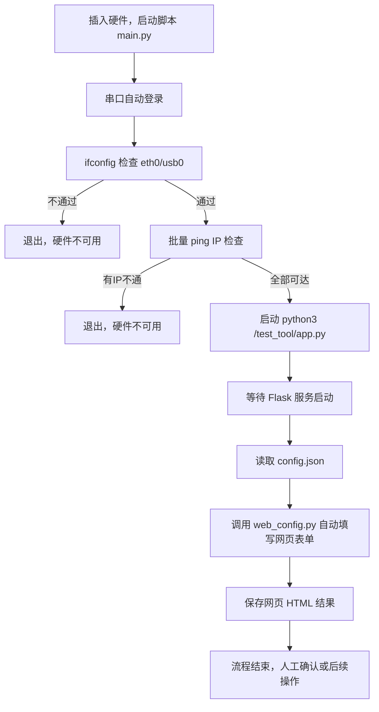

# CheckTerminalNetwork 自动化工具

本项目用于自动化检测嵌入式设备的网络环境、自动登录、批量配置和网页参数填写，适用于批量测试、产线配置等场景。

---

## 自动化整体流程图



---

## 目录结构

```
CheckTerminalNetwork/
├── main.py              # 主流程脚本，负责串口登录、网络检测、服务启动等
├── web_config.py        # 网页自动填写模块（Selenium）
├── config.json          # 外部配置文件，填写需要配置的参数
├── requirements.txt     # Python依赖包列表
├── htmls/               # 自动保存的网页结果目录
└── README.md            # 项目说明文档
```

---

## 依赖环境

- Python 3.7+
- [pyserial](https://pypi.org/project/pyserial/)
- [selenium](https://pypi.org/project/selenium/)
- Chrome 浏览器及 [chromedriver](https://chromedriver.chromium.org/)（需与Chrome版本匹配）

安装依赖：
```shell
pip install -r requirements.txt
```

---

## 配置说明

### config.json 示例

```json
{
    "mqtt_server_ip": "106.15.42.105:8000",
    "plane_name": "A38"
}
```
- 支持只填写你关心的字段，未填写的不做修改。
- `plane_name` 用于保存网页结果文件名。

---

## 使用方法

1. **插入设备，连接串口**
2. **运行主脚本**
    ```shell
    python main.py
    ```
3. **自动完成：**
    - 串口自动登录、网络检测
    - 启动服务并等待
    - 自动填写网页表单并保存结果
4. **在 htmls 目录下查看网页保存结果**

---

## 常见问题

- **串口无法登录/卡死？**  
  自动脚本会多次发送 Ctrl+C、exit、回车，确保终端可控。如仍异常，建议手动重启设备。
- **chromedriver 报错？**  
  请确保 chromedriver 版本与 Chrome 浏览器一致，并已配置到 PATH。
- **网页自动填写失败？**  
  检查 config.json 字段是否正确，网页是否可访问。

---

## 贡献与扩展

- 支持更多设备、更多网页字段，只需扩展 `config.json` 和 `FIELD_ID_MAP`。
- 支持批量设备、批量配置，可自行循环调用主流程。

---

如有问题或建议，欢迎提 issue 或联系作者！